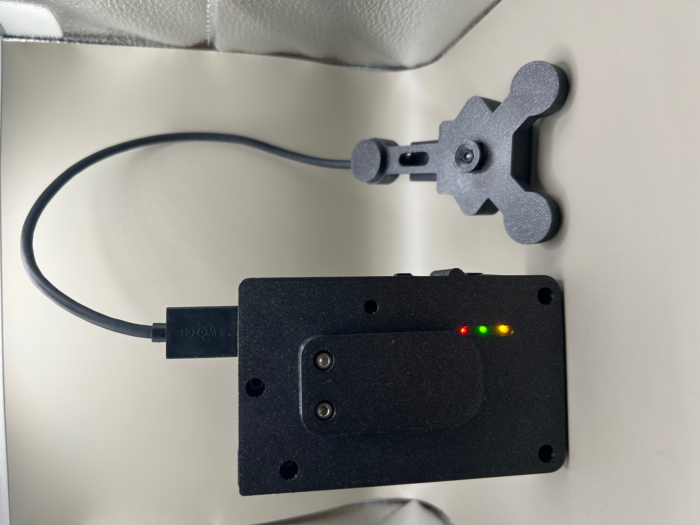
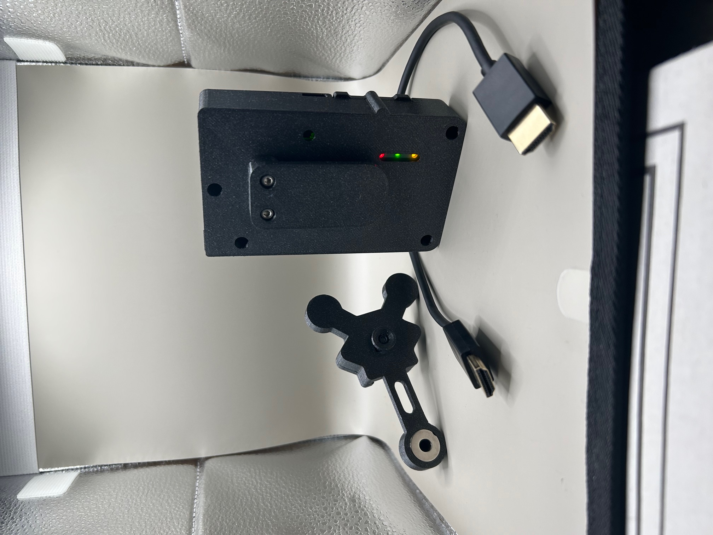
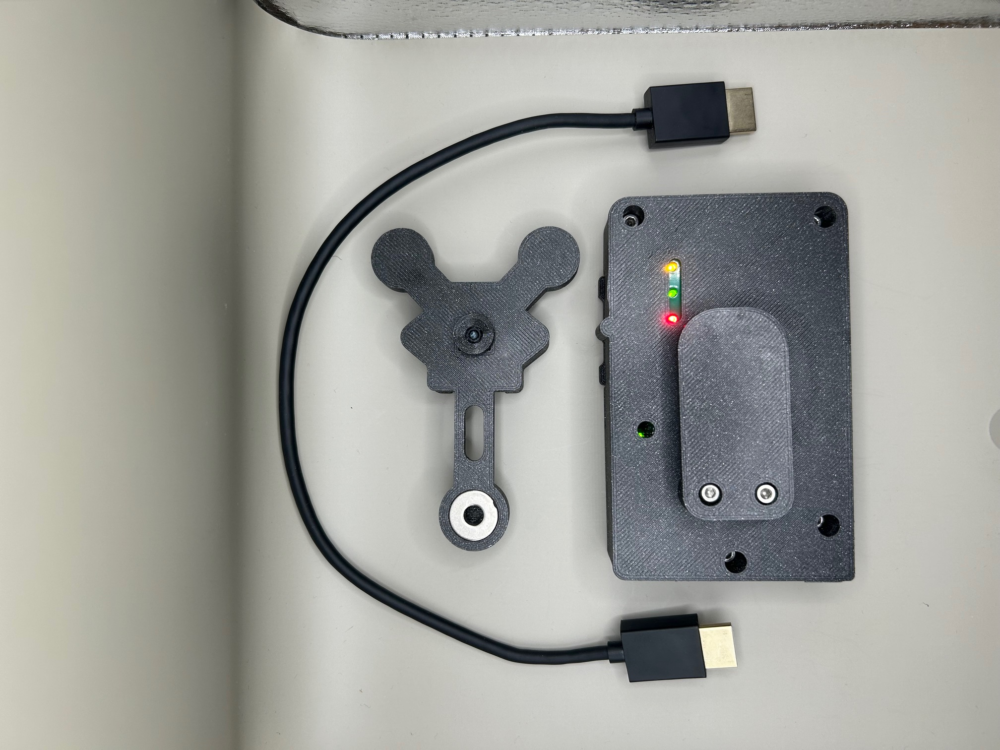

# QuizPal

**QuizPal**
Proof-of-concept demonstration of real-time wearable AI systems and edge-to-cloud pipelines. Built purely as an engineering challenge to explore low-latency computer vision + LLM integration on constrained hardware. Not intended for any use that violates academic or professional integrity policies.

A real-time wearable AI visual assistant that processes visual input from custom hardware and returns structured answers in real-time via WebSocket.

## Hardware

The physical setup consists of a 3D-printed enclosure housing a Raspberry Pi Zero paired with an Ultra HD Arducam mini camera, connected to an external display via HDMI. A vibration module provides haptic feedback for notifications. The device connects over Wi-Fi or 4G to communicate with the cloud backend, and a custom 3D-printed mounting stand allows flexible positioning. Status LEDs on the enclosure provide real-time visual feedback on the device state.

<table>
  <tr>
    <td></td>
    <td></td>
  </tr>
  <tr>
    <td></td>
    <td></td>
  </tr>
</table>

## Architecture

```
┌──────────┐     ┌────────┐     ┌──────────────┐     ┌─────────┐     ┌───────────┐
│  Client   │────▶│   S3   │────▶│  Lambda      │────▶│ DynamoDB│     │ WebSocket │
│ (Upload)  │     │ Bucket │     │ (Processing) │────▶│ (Store) │     │  (Notify) │
└──────────┘     └────────┘     └──────────────┘     └─────────┘     └───────────┘
                                       │
                          ┌────────────┼────────────┐
                          ▼            ▼            ▼
                     ┌────────┐  ┌──────────┐  ┌────────┐
                     │  YOLO  │  │  Claude/  │  │ Prompt │
                     │  (CV)  │  │  GPT-4    │  │ Engine │
                     └────────┘  └──────────┘  └────────┘
```

## How It Works

1. **Image Upload** — A client uploads a screenshot of an exam question to S3
2. **Object Detection** — YOLOv8 detects the screen/device in the image and crops the relevant area
3. **Image Preprocessing** — OpenCV rotates and cleans the cropped image using Hough line detection
4. **OCR** — Claude 3.5 Sonnet extracts text from the processed image
5. **Classification** — The system determines the question type (verbal vs quantitative) and sub-type (critical reasoning, problem solving, data sufficiency, sentence correction, reading comprehension)
6. **Answer Generation** — A specialized prompt chain routes the question to the appropriate solver using Claude or GPT-4 with few-shot examples
7. **Response Delivery** — The answer is stored in DynamoDB and pushed to the client via WebSocket

## Key Features

- **Multi-stage image pipeline**: Two-pass YOLO detection (device → screen) with rotation correction
- **Multi-image reading comprehension**: Handles passages split across multiple screenshots by storing partial text and merging when complete
- **Question-type routing**: Different prompt strategies for each exam question category
- **Real-time feedback**: WebSocket notifications for instant answer delivery
- **Serverless deployment**: Runs entirely on AWS Lambda with Docker containers

## Tech Stack

| Layer | Technology |
|-------|-----------|
| Compute | AWS Lambda (Docker) |
| Storage | S3, DynamoDB |
| Real-time | API Gateway WebSocket |
| Computer Vision | YOLOv8, OpenCV |
| OCR | Claude 3.5 Sonnet |
| NLP / Answering | GPT-4, Claude 3.5 Sonnet |
| Text Similarity | spaCy (en_core_web_md) |
| IaC | CloudFormation |

## Project Structure

```
quizpal/
├── main.py                          # Lambda handler (entry point)
├── app_local.py                     # Flask app for local development
├── utils.py                         # S3, DynamoDB, WebSocket utilities
├── pipeline/
│   └── generate_full_response.py    # Main processing pipeline
├── vision/
│   ├── image_preprocessing.py       # YOLO detection + OpenCV preprocessing
│   ├── claude_ocr.py                # Claude-based OCR
│   ├── openai_ocr.py                # OpenAI GPT-4V OCR (fallback)
│   └── mathpix_ocr.py               # Mathpix OCR (math-focused)
├── prompts_template/
│   ├── prompt_engineering.py        # Prompt chains for classification & answering
│   └── exercise_samples.py          # Few-shot examples for each question type
├── cloudformation/
│   ├── template.yaml                # Lambda, DynamoDB, API Gateway
│   └── buckets.yaml                 # S3 bucket definitions
├── Dockerfile                       # Lambda container image
└── requirements.txt                 # Python dependencies
```

## Setup

### Prerequisites
- Python 3.10+
- AWS CLI configured
- Docker (for Lambda deployment)

### Environment Variables

```bash
BUCKET_LAMBDA=<s3-bucket-for-raw-images>
BUCKET_PROCESSED_IMG=<s3-bucket-for-processed-images>
ANTHROPIC_API_KEY=<your-anthropic-api-key>
OPENAI_API_KEY=<your-openai-api-key>
APP_ID=<mathpix-app-id>
APP_KEY=<mathpix-app-key>
```

### Local Development

```bash
pip install -r requirements.txt
python -m spacy download en_core_web_md
python app_local.py
```

### Deploy to AWS

```bash
aws ecr get-login-password --region <region> | docker login --username AWS --password-stdin <account-id>.dkr.ecr.<region>.amazonaws.com
docker build -t quizpal .
docker tag quizpal:latest <account-id>.dkr.ecr.<region>.amazonaws.com/<repo>:latest
docker push <account-id>.dkr.ecr.<region>.amazonaws.com/<repo>:latest
```

## Processing Pipeline

The system handles two main flows:

**Complete questions** (quantitative or short verbal):
```
Image → YOLO → OCR → Classify → Format → Solve → Extract Answer
```

**Multi-image passages** (long reading comprehension):
```
Image 1 → OCR → Detect incomplete → Store partial text
Image 2 → OCR → Merge with stored text → Solve → Extract Answer
```

Text similarity (spaCy) is used to match incoming partial texts with previously stored fragments, enabling seamless multi-screenshot processing.
